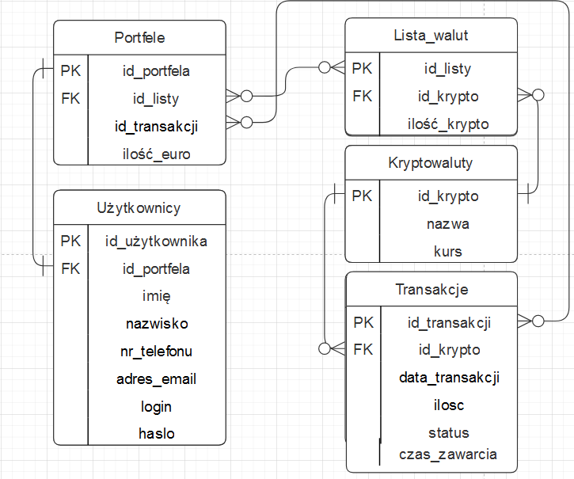

# Projekt zaliczeniowy z przedmiotu: _**Aplikacje internetowe**_

# Temat projektu: Strona do tradowania kryptowalut
## Skład grupy: Łukasz Matusik, Bartosz Kościelniak
## Specyfikacja projektu
### Cel projektu :
#### Cele szczegółowe:
   1. Stworzenie aplikacji tradeingowej kryptowalut
   2. Nauka podstawowych działan na giełdach    
### Funkcjonalności:
   1. Monitorowanie zmian kursu kryptowalut
   2. Funkcja trade'owania kryptowalutami
   3. Wgląd do portfela 
   4. Przesyłanie między portfelami 
   5. Kupowano/sprzedaż walut
### Interfejs serwisu

   

       
Strona głowna

   

	

       
Portfel

   

	

       
Wykres cen kryptowaluty

   

         
### Baza danych
####	Diagram ERD

####	Skrypt do utworzenia struktury bazy danych
`CREATE TABLE Lista_walut (
id_listy 	INT,
id_portfela INT,
id_krypto INT,
ilość_krypto  INT NOT NULL,
PRIMARY KEY (id_listy),
FOREIGN KEY (id_portfela) REFERENCES Portfele(id_portfela),
FOREIGN KEY (id_krypto)	REFERENCES Kryptowaluty(id_krypto)
);`

`CREATE TABLE Portfele (
id_portfela INT,
id_listy INT,
ilość_euro INT NOT NULL,
PRIMARY KEY (id_portfela),
FOREIGN KEY (id_listy) REFERENCES Lista_walut(id_listy)
);`

`CREATE TABLE Użytkownicy (
id_użytkownika INT,
id_portfela INT,
imię VARCHAR(255) NOT NULL,
nazwisko VARCHAR(255) NOT NULL,
nr_telefonu INT NOT NULL,
adres_email VARCHAR(255) NOT NULL,
login VARCHAR(255) NOT NULL,
hasło VARCHAR(255) NOT NULL,
PRIMARY KEY (id_użytkownika),
FOREIGN KEY (id_portfela) REFERENCES Portfele(id_portfela)
);`

`CREATE TABLE Kryptowaluty (
id_krypto INT,
nazwa VARCHAR(255) NOT NULL,
kurs FLOAT, 
PRIMARY KEY (id_krypto)
);`

## Wykorzystane technologie

* HTML
* JavaScript
* PHP
* CSS

## Proces uruchomienia aplikacji (krok po kroku)
*
### Potrzebne nazwy użytkowników do uruchomienia aplikacji
*

