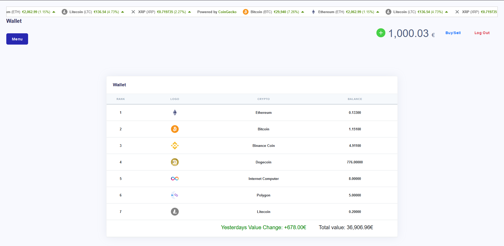
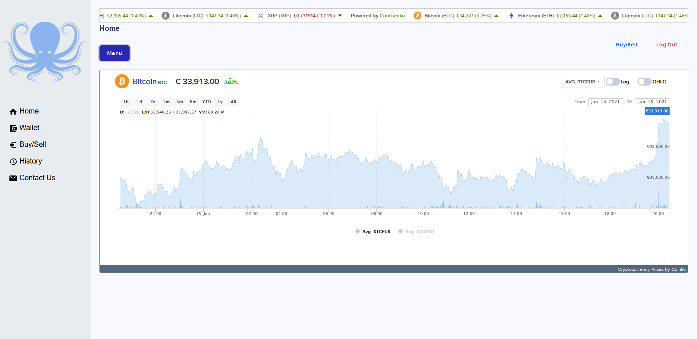
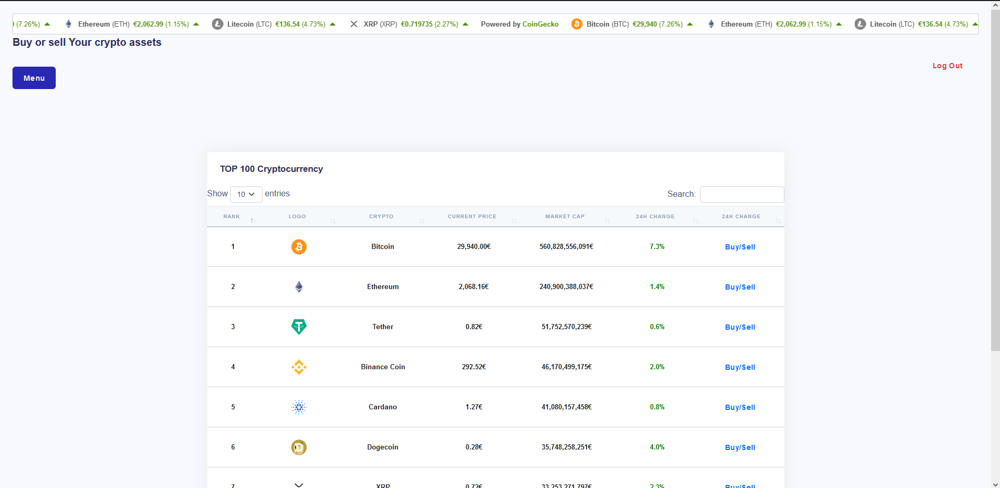
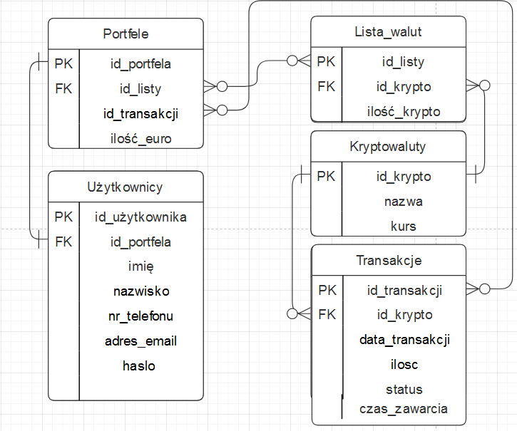

# Projekt zaliczeniowy z przedmiotu: _**Aplikacje internetowe**_

# Temat projektu: Strona do tradowania kryptowalut
## Skład grupy: Łukasz Matusik, Bartosz Kościelniak
## Specyfikacja projektu
### Cel projektu :
#### Cele szczegółowe:
   1. Stworzenie aplikacji tradeingowej kryptowalut
   2. Nauka podstawowych działan na giełdach    
### Funkcjonalności:
   1. Monitorowanie zmian kursu kryptowalut
   2. Funkcja trade'owania kryptowalutami
   3. Wgląd do portfela 
   4. Kupowanie/sprzedaż kryptowalut
### Interfejs serwisu

   <details>
       <summary>Strona głowna</summary>
    <ul>
      
    </ul>
   </details>
	<details>
       <summary>Portfel</summary>
    <ul>
      
    </ul>
   </details>
	<details>
       <summary>Wykres cen kryptowaluty</summary>
    <ul>
      
    </ul>
   </details>
	<details>
       <summary>Zakup kryptowaluty</summary>
    <ul>
      
    </ul>
   </details>
         
### Baza danych
####	Diagram ERD



####	Skrypt do utworzenia struktury bazy danych
```
CREATE TABLE Kryptowaluty ( id_krypto INT NOT NULL, nazwa VARCHAR(255) NOT NULL, kurs FLOAT NOT NULL, 
PRIMARY KEY (id_krypto) );

CREATE TABLE Użytkownicy ( id_użytkownika INT NOT NULL, imię VARCHAR(255) NOT NULL, nazwisko VARCHAR(255) NOT NULL, nr_telefonu INT NOT NULL, adres_email VARCHAR(255) NOT NULL, haslo VARCHAR(255) NOT NULL, 
PRIMARY KEY (id_użytkownika) );

CREATE TABLE Portfele ( id_portfela INT NOT NULL, id_użytkownika INT NOT NULL, ilość_euro FLOAT NOT NULL, 
PRIMARY KEY (id_portfela), FOREIGN KEY (id_użytkownika) REFERENCES Użytkownicy(id_użytkownika) );

CREATE TABLE Lista_walut ( id_listy INT NOT NULL AUTO_INCREMENT, id_portfela INT NOT NULL ,id_krypto INT, ilość_krypto FLOAT NOT NULL, 
PRIMARY KEY (id_listy), FOREIGN KEY (id_krypto) REFERENCES Kryptowaluty(id_krypto), FOREIGN KEY (id_portfela) REFERENCES Portfele(id_portfela) );

CREATE TABLE Transakcje ( id_transakcji INT NOT NULL AUTO_INCREMENT, id_krypto INT NOT NULL, id_portfela INT NOT NULL, data_transakcji DATE NOT NULL, czas_zawarcia TIME NOT NULL, ilosc FLOAT NOT NULL, status VARCHAR(255) NOT NULL, kurs_transakcji FLOAT NOT NULL, 
PRIMARY KEY (id_transakcji), FOREIGN KEY (id_krypto) REFERENCES Kryptowaluty(id_krypto), FOREIGN KEY (id_portfela) REFERENCES Portfele (id_portfela) );

```
## Wykorzystane technologie

* HTML
* JavaScript
* PHP
* Bootstrap
* CSS

## Proces uruchomienia aplikacji (krok po kroku)
1. Należy umieścić projekt w folderze **\xampp\htdocs** 
2. W phpMyAdmin należy stworzyć baze danych i zaimportować plik **baza_danych.sql**
3. W pliku **xampp\htdocs\20-21-ai-projekt-lab3-projekt-ai-koscielniak-b-matusik-l\dataBaseConnector.php** można dostosować połączenie pod swoja baze
4. W przeglądarce wpisujemy adres localhost i wybieramy folder z projektem
5. Na stronie startowej pod przyciskiem **Log In** można się zalogować i zacząć korzystać z strony
### Potrzebne nazwy użytkowników do uruchomienia aplikacji
1. Konto z historią oraz listami kryptowalut
* Adres e-mail: **g@gmail.com**
* Hasło: **adminadmin**
2. Nowe konto bez historii oraz kryptowalut
* Adres e-mail: **tes1t@gmail.com**
* Hasło: **testtest**
3. Baza danych: [baza_danych.sql](https://github.com/UR-INF/20-21-ai-projekt-lab3-projekt-ai-koscielniak-b-matusik-l/blob/main/baza_danych.sql)

