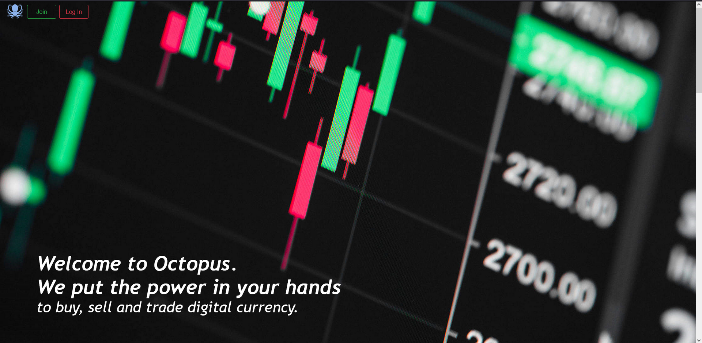

# Cryptocurrency Exchange
> Website created to initiate crypto exchanges, that make us familiarized with basic crypto market functions .

## Table of contents
* [General info](#general-info)
* [Screenshots](#screenshots)
* [Setup](#setup)
* [Code Examples](#code-examples)
* [Tech/framework used](#techframework-used)
* [Status](#status)
* [Contact](#contact)
* [License](#license)

## General info
>The project was created by myself and [@Lukasz Matusik](https://github.com/lukas1299) as a final paper of Internet Application.
>All crypto informations and  data(price,market cap, rank etc) is fetched from CoinGecko API.

## Screenshots

   

       
Main page

    <ul>
      
    </ul>
   

	

       
Wallet

    <ul>
      
    </ul>
   

	

       
Coin price chart

    <ul>
      
    </ul>
   

	

       
Buy/Sell panel

    <ul>
      
    </ul>
   

## Setup

>1. Place project folder in **\xampp\htdocs**
>2. In phpMyAdmin create database and import out file **baza_danych.sql**
>3. In **xampp\htdocs\20-21-ai-projekt-lab3-projekt-ai-koscielniak-b-matusik-l\dataBaseConnector.php** adjust connection properties
>4. In websites URL field type localhost
>5. On main page you can **Log In** with accounts provided below or create new one
>
> Account with coins and transactions history
>* Adres e-mail: **g@gmail.com**
>* Hasło: **adminadmin**
> 
>Wiped account without any coins in wallet nor trade history
>* Adres e-mail: **tes1t@gmail.com**
>* Hasło: **testtest**
> 
>Data base: [baza_danych.sql](https://github.com/BartoszKoscielniak/CryptoExch/blob/main/baza_danych.sql)
## Code Examples
Show examples of usage:

    $ch = curl_init();
    $url = "https://api.coingecko.com/api/v3/coins/markets?vs_currency=eur&order=market_cap_desc&per_page=100&page=1&sparkline=false";
    curl_setopt($ch, CURLOPT_URL, $url);
    curl_setopt($ch, CURLOPT_RETURNTRANSFER, true);
    $response = curl_exec($ch);

    mysqli_report(MYSQLI_REPORT_STRICT);
    $connection = new mysqli($host, $db_user, $db_password, $db_name);

    if ($e = curl_error($ch)) {
        echo $e;
    } else {
        $decoded = json_decode($response, true);
    }
    curl_close($ch);

    ////

    $_SESSION['totalWalletValue'] = 0;
    $_SESSION['yesterdaysTotalValueDifference'] = 0;
    for ($u = 0; $u < sizeof($_SESSION['lista_walut']); $u++){
        for ($g = 0; $g < sizeof($_SESSION['krypto']); $g++){
            if ($_SESSION['lista_walut'][$u][1] == $_SESSION['portfel'][0][0] && $_SESSION['lista_walut'][$u][2] == $_SESSION['krypto'][$g][0] && $_SESSION['lista_walut'][$u][3] > 0){
                $_SESSION['totalWalletValue'] = $_SESSION['totalWalletValue'] + $_SESSION['lista_walut'][$u][3] * $_SESSION['krypto'][$g][2];

                for ($next = 0; $next < sizeof($decoded); $next++) {
                    if ($_SESSION['krypto'][$g][1] == $decoded[$next]['name']) {
                        $chi = curl_init();
                        $urli = "https://api.coingecko.com/api/v3/coins/{$decoded[$next]['id']}/market_chart?vs_currency=eur&days=1&interval=daily";
                        curl_setopt($chi, CURLOPT_URL, $urli);
                        curl_setopt($chi, CURLOPT_RETURNTRANSFER, true);
                        $resp = curl_exec($chi);
                        $priceDayBefore = json_decode($resp, true);

                        curl_close($chi);
                        if (curl_errno($chi) != 0){
                            echo curl_errno($chi);
                        }
                        $_SESSION['yesterdaysTotalValueDifference'] = $_SESSION['yesterdaysTotalValueDifference'] + $_SESSION['lista_walut'][$u][3] * $priceDayBefore['prices'][0][1];
                        break 2;
                    }
                }
            }
        }
    }

## Tech/framework used

* HTML
* JavaScript 
* PHP
* CSS
* Bootstrap
* MySQL

## Status
Project is: _finished_ :monocle_face:

## Contact
[@Bartosz Koscielniak](https://github.com/BartoszKoscielniak)

[@Lukasz Matusik](https://github.com/lukas1299)

## License
[MIT](https://choosealicense.com/licenses/mit/) ©

